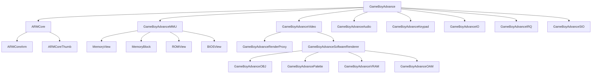

# GBA模拟器项目架构分析文档

## 1. 项目整体架构概览

GBA模拟器采用模块化设计，核心组件包括CPU模拟、内存管理、图形处理、音频处理、输入处理等。整体架构如下图所示：



## 2. 核心模块分析

### 2.1 主控制器 GameBoyAdvance (gba.js)

这是整个模拟器的核心控制器，负责协调各个子系统的运行。

**主要职责**:
- 初始化所有子系统
- 管理模拟器运行循环
- 处理ROM加载和存档管理
- 协调各组件间的数据交互

**关键方法**:
- reset(): 重置模拟器状态
- runStable(): 启动稳定的模拟器循环
- step(): 执行单步模拟
- setCanvas(): 设置渲染画布

### 2.2 CPU模拟器 ARMCore (core.js)

负责模拟ARM7TDMI处理器，支持ARM和Thumb指令集。

**主要特性**:
- 支持ARM和Thumb两种执行模式
- 实现完整的ARM指令集模拟
- 包含处理器状态管理（CPSR寄存器等）
- 实现中断处理机制

**关键组件**:
- ARMCoreArm: ARM指令集编译器
- ARMCoreThumb: Thumb指令集编译器

### 2.3 内存管理单元 GameBoyAdvanceMMU (mmu.js)

负责模拟GBA的内存映射和访问。

**内存区域**:
- BIOS ROM (0x00000000-0x00003FFF)
- WRAM (0x02000000-0x0203FFFF)
- IWRAM (0x03000000-0x03007FFF)
- IO寄存器 (0x04000000-0x040003FF)
- 调色板RAM (0x05000000-0x050003FF)
- VRAM (0x06000000-0x06017FFF)
- OAM (0x07000000-0x070003FF)
- ROM (0x08000000-0x0FFFFFFF)

**关键功能**:
- 内存区域映射管理
- DMA传输处理
- 等待状态模拟

### 2.4 图形处理 GameBoyAdvanceVideo (video.js)

负责图形渲染和显示。

**渲染路径**:
- GameBoyAdvanceRenderProxy: 使用Web Worker的硬件加速渲染器
- GameBoyAdvanceSoftwareRenderer: 纯软件渲染器

**关键功能**:
- LCD控制器模拟
- 背景层渲染
- 精灵渲染
- 调色板管理

### 2.5 音频处理 GameBoyAdvanceAudio (audio.js)

负责音频生成和输出。

**支持的音频通道**:
- 方波通道x2
- 波形通道
- 噪声通道
- 直接音频通道A/B (用于采样音频)

**关键功能**:
- PSG(可编程声音发生器)模拟
- FIFO音频缓冲
- Web Audio API集成

### 2.6 输入处理 GameBoyAdvanceKeypad (keypad.js)

负责处理用户输入。

**支持的输入设备**:
- 键盘输入
- 游戏手柄

**按键映射**:
- 方向键: Up, Down, Left, Right
- 动作键: A, B
- 功能键: Start, Select
- 肩键: L, R

## 3. 代码执行流程

### 3.1 初始化流程
1. 创建GameBoyAdvance实例
2. 初始化各子系统（CPU, MMU, IO, Audio, Video, Keypad等）
3. 建立组件间引用关系
4. 注册键盘事件处理

### 3.2 ROM加载流程
1. 通过loadRomFromFile或setRom加载ROM数据
2. 解析ROM头部信息
3. 初始化内存映射
4. 加载BIOS和存档数据

### 3.3 运行循环流程
1. 调用runStable()启动主循环
2. 在定时器回调中调用advanceFrame()
3. advanceFrame()中调用step()执行CPU指令
4. CPU执行过程中访问MMU进行内存读写
5. MMU更新触发Video和Audio更新
6. 每帧结束时调用渲染回调

## 4. 数据流向分析

### 4.1 指令执行数据流
```
CPU执行 → MMU内存访问 → IO寄存器更新 → Video/Audio/其他设备响应
```

### 4.2 渲染数据流
```
Video渲染 → 调色板数据 → VRAM/OAM数据 → 像素数据 → Canvas绘制
```

### 4.3 音频数据流
```
CPU执行 → 音频寄存器更新 → 音频通道生成样本 → FIFO缓冲 → Web Audio输出
```

## 5. 关键设计模式

### 5.1 组合模式
各核心组件通过组合方式构建，GameBoyAdvance类包含所有子系统实例。

### 5.2 观察者模式
通过回调函数实现组件间通信，如视频渲染完成回调、音频处理回调等。

### 5.3 策略模式
支持多种渲染器（硬件加速和软件渲染），通过配置选择使用。

## 6. 性能考虑

### 6.1 指令缓存
实现了指令缓存机制，避免重复解析相同指令。

### 6.2 内存访问优化
通过内存视图和页面缓存优化内存访问性能。

### 6.3 渲染优化
使用Web Worker进行渲染计算，避免阻塞主线程。