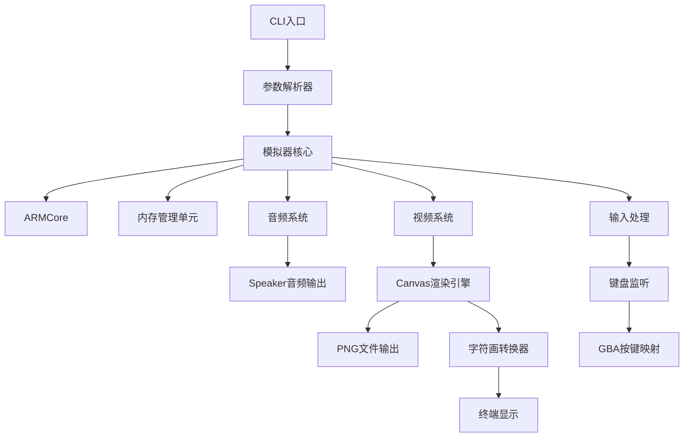

# GBA.js CLI Node.js版本设计文档

## 🎯 项目概述

**gbajs2-cli** 将原版浏览器 GBA 模拟器改造为 Node.js 原生命令行工具，提供完整的本地运行能力，无需浏览器环境。

### 核心改造目标
- ❌ **完全移除浏览器依赖**：DOM、Canvas、Web Audio API 等
- ✅ **纯 Node.js 实现**：使用原生模块和最佳实践
- ✅ **命令行界面**：提供完整的 CLI 参数支持
- ✅ **多种输出模式**：PNG 图片序列、终端字符画显示
- ✅ **原生音频输出**：跨平台音频播放支持

---

## 🏗️ 整体架构设计

### 系统架构图



---

## 📦 核心模块设计

### 1. 核心模拟器模块 (`src/core/`)

#### 主要组件
- **ARMCore** (`armcore.js`) - ARM7TDMI CPU 模拟
- **MMU** (`mmu.js`) - 内存管理单元
- **IRQ** (`irq.js`) - 中断处理
- **IO** (`io.js`) - 硬件 I/O 寄存器
- **GameBoyAdvance** (`gba.js`) - 主控制器

### 2. 音频系统模块 (`src/audio/`)

#### 核心组件
```javascript
// 音频系统架构
class GBAAudioSystem {
  constructor() {
    this.sampleRate = 44100;
    this.bufferSize = 1024;
    this.outputStream = new SpeakerOutput();
  }
  
  processAudioSamples(samples) {
    // 音频样本处理和播放
    this.outputStream.play(samples);
  }
}
```

### 3. 视频系统模块 (`src/renderers/`)

#### Canvas渲染策略
使用 **node-canvas** 作为渲染中间层，最大限度复用原有渲染逻辑。

#### 核心组件
```javascript
// Canvas渲染器
class CanvasRenderer {
  constructor(width, height) {
    this.canvas = createCanvas(width, height);
    this.ctx = this.canvas.getContext('2d');
  }
}

// ASCII转换器
class ASCIIConverter {
  constructor(options = {}) {
    this.width = options.width || 80;
    this.height = options.height || 24;
    this.colorMode = options.colorMode || 'ansi256';
  }
}
```

### 4. 输入处理模块 (`src/input/`)

```javascript
// 输入处理架构
class KeyboardInputProcessor {
  constructor() {
    this.keyMap = new GBAKeyMap();
    this.stateTracker = new KeyStateTracker();
  }
}
```

---

## 🎮 GBA硬件模拟设计

### 内存映射布局

| 地址范围 | 用途 | 大小 |
|---------|------|------|
| 0x00000000-0x00003FFF | BIOS ROM | 16KB |
| 0x02000000-0x0203FFFF | WRAM | 256KB |
| 0x03000000-0x03007FFF | IWRAM | 32KB |
| 0x04000000-0x040003FF | IO 寄存器 | 1KB |
| 0x05000000-0x050003FF | 调色板 RAM | 1KB |
| 0x06000000-0x06017FFF | VRAM | 96KB |
| 0x07000000-0x070003FF | OAM | 1KB |
| 0x08000000-0x0FFFFFFF | ROM | 最大32MB |

---

## 📁 目录结构设计

```
gbajs2-cli/
├── bin/
│   └── gbajs2.js              # CLI 入口点
├── src/
│   ├── index.js               # 主模块入口
│   ├── core/                  # 核心模拟器
│   │   ├── armcore.js         # ARM CPU 核心
│   │   ├── mmu.js             # 内存管理
│   │   ├── irq.js             # 中断处理
│   │   ├── io.js              # IO 寄存器
│   │   └── gba.js             # 主控制器
│   ├── cli/                   # CLI 接口
│   │   ├── parser.js          # 参数解析
│   │   ├── validator.js       # 参数验证
│   │   └── index.js           # CLI 主逻辑
│   ├── audio/                 # 音频系统
│   │   ├── speaker-output.js  # Speaker 音频输出
│   │   ├── audio-buffer.js    # 音频缓冲管理
│   │   └── audio-context.js   # 音频上下文
│   ├── input/                 # 输入处理
│   │   ├── keyboard.js        # 键盘监听
│   │   ├── keymap.js          # 按键映射
│   │   └── state-tracker.js   # 状态跟踪
│   ├── renderers/             # 渲染器
│   │   ├── canvas-setup.js    # Canvas 初始化
│   │   ├── png-output.js      # PNG 输出
│   │   └── ascii-converter.js  # ASCII 转换
│   └── utils/                 # 工具函数
│       ├── logger.js          # 日志系统
│       ├── file-utils.js      # 文件操作
│       └── config.js          # 配置管理
├── resources/
│   └── bios.bin               # GBA BIOS 文件
├── test/                      # 测试文件
└── docs/                      # 文档
```

---

## 🔧 接口设计

### CLI 参数结构

```javascript
{
  romFile: 'game.gba',           // ROM文件路径
  renderer: 'both',              // 渲染器: ascii|png|both
  output: './frames',            // 输出目录
  fps: 60,                       // 帧率设置
  color: false,                  // 彩色字符画
  colorMode: 'ansi256',          // 颜色模式: ansi16|ansi256|rgb
  volume: 1.0,                   // 音量 0-1
  biosPath: './resources/bios.bin' // BIOS文件路径
}
```

---

这个设计文档为 GBA.js CLI 提供了核心的技术架构，详细的实现方案和开发任务请参考 `tasks.md`。