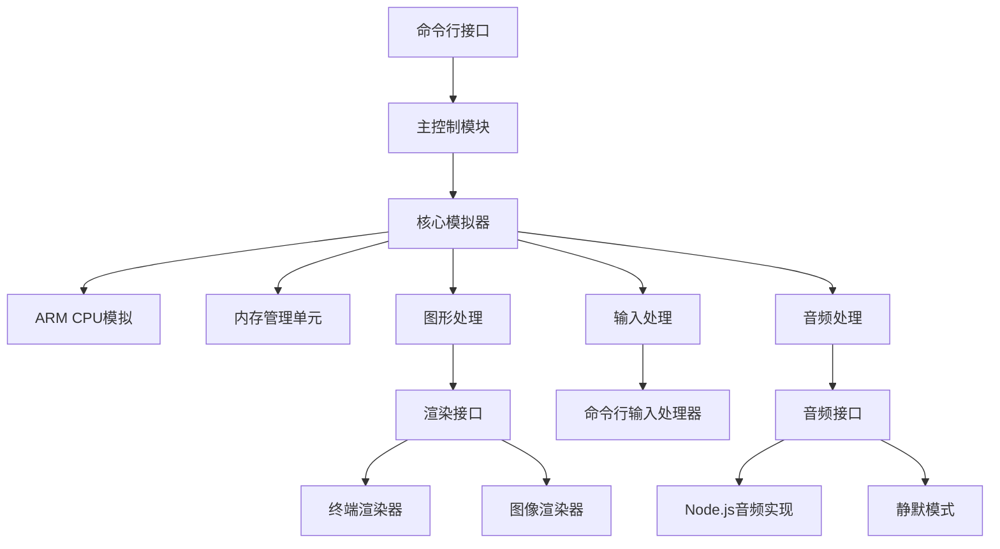

# GBA模拟器Node.js改造设计文档

## 1. 当前项目技术痛点分析

### 1.1 浏览器依赖性
当前项目严重依赖浏览器环境，使用了大量浏览器API：
- **Canvas API**: 用于图形渲染
- **Web Audio API**: 用于音频处理
- **DOM API**: 用于用户界面和事件处理
- **FileReader API**: 用于文件加载

### 1.2 输入输出限制
- **显示输出**: 依赖HTML Canvas元素进行像素绘制
- **用户输入**: 依赖键盘事件和游戏手柄API
- **文件系统**: 依赖浏览器的文件API和localStorage

### 1.3 架构耦合度高
- 核心模拟逻辑与浏览器UI紧密耦合
- GameBoyAdvance类直接操作DOM元素和Canvas上下文

## 2. 解决方案

### 2.1 解耦核心模拟器与显示层
1. **抽象显示接口**: 创建统一的显示接口，将当前Canvas实现替换为可插拔的渲染器
2. **终端渲染器**: 实现基于终端字符的渲染器
3. **图像文件渲染器**: 实现渲染到图像文件的渲染器

### 2.2 替换输入处理机制
1. **标准输入处理**: 使用Node.js的readline或stdin处理用户输入
2. **按键映射**: 实现与当前键盘映射兼容的命令行按键处理

### 2.3 文件系统适配
1. **Node.js文件API**: 使用fs模块替换浏览器FileReader
2. **存储适配**: 使用文件系统替换localStorage实现存档功能

### 2.4 音频处理
1. **可选音频支持**: 集成node-audio库或其他Node.js音频库
2. **静默模式**: 提供无音频运行选项

## 3. 系统架构设计

### 3.1 整体架构图


### 3.2 核心模块说明

#### 3.2.1 主控制模块
- 负责解析命令行参数
- 初始化模拟器各组件
- 协调各模块工作流程

#### 3.2.2 渲染接口层
- 定义统一的渲染接口
- 实现多种渲染器的动态切换

#### 3.2.3 输入处理模块
- 处理标准输入事件
- 实现按键映射和游戏控制

#### 3.2.4 存储适配模块
- 实现文件系统存档
- 提供与浏览器localStorage兼容的API

## 4. 实施步骤

### 4.1 第一阶段：环境适配
1. 创建Node.js项目结构
2. 实现文件加载功能（替换FileReader）
3. 实现基本的命令行参数解析

### 4.2 第二阶段：显示系统改造
1. 抽象渲染接口
2. 实现终端字符渲染器
3. 实现图像文件渲染器

### 4.3 第三阶段：输入系统改造
1. 实现命令行输入处理
2. 映射游戏控制按键
3. 集成到主模拟器循环

### 4.4 第四阶段：存储系统改造
1. 实现文件系统存档
2. 替换localStorage相关功能

### 4.5 第五阶段：音频系统（可选）
1. 集成Node.js音频库
2. 实现音频输出功能

### 4.6 第六阶段：测试与优化
1. 功能测试
2. 性能优化
3. 文档编写

## 5. 开发流程

### 5.1 开发环境准备
- Node.js v12+
- npm或pnpm包管理器
- 代码编辑器
- 版本控制系统(git)

### 5.2 代码结构规划
```
gbajs2-node/
├── bin/                 # 命令行入口
├── src/
│   ├── core/           # 核心模拟器代码
│   ├── renderer/       # 渲染器实现
│   ├── input/          # 输入处理
│   ├── storage/        # 存储适配
│   └── audio/          # 音频处理
├── test/               # 测试代码
├── docs/               # 文档
├── package.json
└── README.md
```

### 5.3 依赖管理
- 保持原有模拟器核心逻辑不变
- 添加Node.js特有依赖（如终端渲染、音频处理等库）